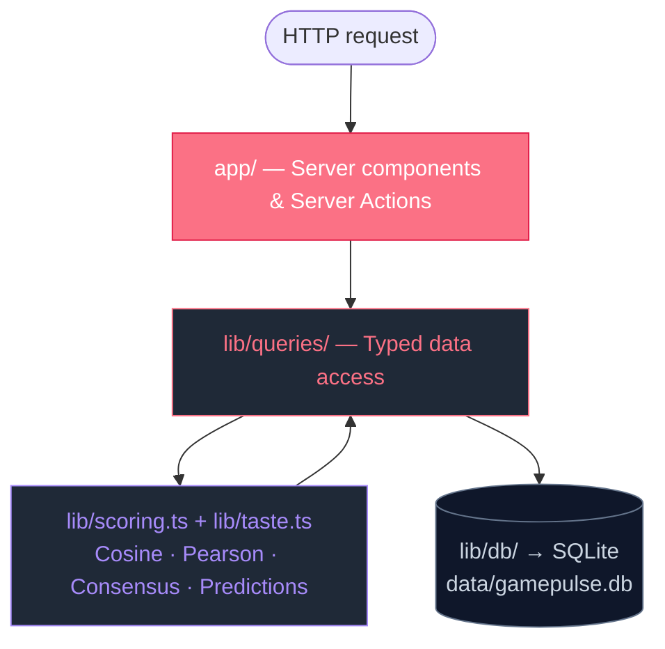

# Architecture

GamePulse is a **single Next.js application** with a strict four-layer architecture. There are no microservices, no separate API tier, and no external dependencies beyond a local SQLite file.

## The four layers



Each layer has exactly one job:

| Layer | Job | Rule |
| --- | --- | --- |
| **Routes** (`app/`) | Render UI, handle form submissions | Never call `getDb()` directly |
| **Queries** (`lib/queries/`) | Translate route needs into SQL | Never compute scores inline |
| **Algorithms** (`lib/scoring.ts`, `lib/taste.ts`) | Pure math — no I/O | Never read from `process.env` or DB |
| **Database** (`lib/db/`) | Schema, seeds, connection | Lazy singleton, applied once per process |

If you find yourself violating one of those rules, the wrong layer is doing the work.

## Why one Next.js app?

The MVP-era temptation is to split this into an API server and a SPA. We didn't, for three concrete reasons:

1. **Server components let queries run on the request thread**, so there's no JSON-over-HTTP round trip between "API" and "UI" — just a function call.
2. **Server actions remove the need for a REST or RPC layer** for mutations. The form posts to the server, the server writes to SQLite, returns an `ActionResult`, and the page revalidates.
3. **`better-sqlite3` is synchronous**, which means query functions read like normal functions — no `await` ceremony, no connection pooling, no `Promise<Row[]>` everywhere.

The result is a codebase that's smaller, faster to navigate, and far easier to test.

## Request lifecycle

Take the game detail page as a concrete example.

```
GET /games/brass-birmingham
  └─▶ app/games/[slug]/page.tsx (server component)
        └─▶ lib/queries/games.ts → getGamePageData("brass-birmingham")
              ├─▶ SQLite: SELECT * FROM games WHERE slug = ?
              ├─▶ SQLite: SELECT critic_reviews + critics JOIN
              ├─▶ SQLite: SELECT community_reviews
              ├─▶ SQLite: SELECT game_prices
              └─▶ lib/scoring.ts → buildConsensus(critics, community, rising)
        └─▶ render <ScoreCard /> <ConsensusBadge /> <SimilarGames /> …
```

Notice what's **not** there: no `fetch()`, no `await response.json()`, no React Query, no SWR. Server components call query functions and pass the data into JSX.

## Mutation lifecycle

Submitting a community review:

```
<form action={submitCommunityReview}>
  └─▶ "use server"  →  lib/actions.ts → submitCommunityReview()
        ├─▶ rateLimit("submitCommunityReview", 5)
        ├─▶ validate gameId, rating, review length
        ├─▶ SQLite: INSERT OR REPLACE INTO community_reviews
        ├─▶ revalidatePath("/games/[slug]", "/", "/me", "/critics", ...)
        ├─▶ updateTag(MATCHED_CRITICS_CACHE_TAG)
        └─▶ return { success: true, message: "Thanks for the review!" }
```

Because the matched-critics cache is invalidated, the next dashboard render recomputes taste matches with your new rating included.

## Caching strategy

GamePulse uses **three layers** of caching, in order of granularity:

1. **`React.cache()`** in `lib/queries/` for memoization within a single request.
2. **`unstable_cache()`** for data that's expensive and rarely changes (e.g. search options).
3. **`revalidatePath` / `updateTag`** in server actions to bust caches after writes.

The tag `matched-critics` is the only cross-route invalidation — everything else uses path-based revalidation.

## What's intentionally simple

- **No ORM.** Raw SQL via `better-sqlite3`. Queries are short, fast, and explicit. Parameter binding via `?` always.
- **No user auth.** A mock user (`alex`) is returned by `getCurrentUser()`. Adding NextAuth.js (or similar) is a roadmap item, not a refactor.
- **No background jobs.** Score columns on the `games` table are refreshed during seeding. In production with mutations, scores are recomputed on read.

## Where to go next

- [Scoring Model](./scoring.md) — how badges and personalized predictions are calculated.
- [Taste Matching](./taste-matching.md) — the math behind matched critics.
- [Data Model](./data-model.md) — every table and its purpose.
