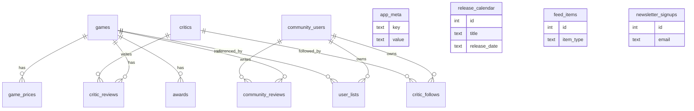

# Data Model

GamePulse uses **one SQLite database** with **twelve tables**. Everything is in [`lib/db/schema.ts`](https://github.com/TabletopFoundry/gamepulse/blob/main/lib/db/schema.ts).

## Schema overview

## Table reference

### `games`

The catalog. One row per game, with denormalized score columns for read speed.

| Column | Type | Purpose |
| --- | --- | --- |
| `id` | INTEGER PK | Auto-increment |
| `slug` | TEXT UNIQUE | URL-safe identifier (`brass-birmingham`) |
| `title`, `description`, `year` | TEXT/INT | Display metadata |
| `categories`, `mechanics` | TEXT (JSON) | Arrays parsed by `parseGame()` |
| `min_players`, `max_players`, `play_time`, `complexity` | numeric | Filter inputs |
| `taste_profile` | TEXT (JSON) | 6-dimension `TasteProfile` |
| `buzz`, `rising` | INTEGER | Momentum signals (0–100) |
| `critics_score`, `community_score` | INTEGER | Precomputed dual scores |
| `critic_reviews_count`, `community_reviews_count` | INTEGER | Render hints |

### `critics`

The 14 named critics in the seed. Each has a `taste_profile` and a `preferred_complexity`.

### `community_users`

Real-feeling user accounts. One row has `is_current = 1` — the mock user `alex` returned by `getCurrentUser()`.

### `critic_reviews`

Many-to-many: which critic reviewed which game.

| Column | Notes |
| --- | --- |
| `score` | 0–100 |
| `verdict` | Short label (`"Buy"`, `"Skip"`, `"Watch"`) |
| `excerpt` | One-paragraph review text |
| `source`, `content_type` | Where the review "came from" (e.g. `"YouTube"`, `"podcast"`) |

### `community_reviews`

User ratings (1–10) with optional text. Unique on `(game_id, user_id)` — submitting again upserts.

### `user_lists`

Watchlist and wishlist entries. The `list_type` column is constrained to `LIST_TYPES = ["watchlist", "wishlist"]`.

### `critic_follows`

Who follows whom. Used for the personalized feed.

### `game_prices`

Retailer × game with price + shipping label. Pure display data.

### `awards`

`(game_id, award_name, award_year, result)` — e.g. *Spiel des Jahres 2022, "Recommended"*.

### `release_calendar`

Upcoming releases (not tied to a game row). Used by the feed.

### `feed_items`

Pre-seeded reviews, news, deals, and videos. Filtered by `item_type` and surfaced on `/feed`.

### `newsletter_signups`

Email + opaque `manage_token` for the self-serve unsubscribe page at `/newsletter/manage`.

### `app_meta`

A key-value table for runtime metadata. The most important key is `seed_version` — the seeder uses it to decide whether to reseed.

## Conventions

- **All JSON columns are typed at the parser boundary**, not at the SQL boundary. See `lib/queries/parsers.ts`.
- **All scores are integers 0–100.** No floats outside ratings (1–10) and similarity (0–1).
- **All timestamps are ISO 8601 strings.** No epoch millis.
- **Slugs are URL-safe and unique.** They're the public identifier — `id`s are internal.

## Mock authentication

`getCurrentUser()` returns the row in `community_users` with `is_current = 1`. All server actions operate as that user.

### What changes when you add real auth

The minimum diff is:

1. Add a session/JWT layer (NextAuth, Clerk, etc.).
2. Replace the body of `getCurrentUser()` with `await getServerSession()` + a lookup by external ID.
3. Add a `users` table or extend `community_users` with auth columns (`external_id`, `email`, `provider`).
4. Wire signup to write to that table.

Server actions and queries don't need to change — they already accept a user from `getCurrentUser()`.

## Indexing

The seed creates indexes on the obvious foreign keys: `critic_reviews(game_id)`, `community_reviews(game_id, user_id)`, `user_lists(user_id, list_type)`. For a catalog of 60 games, full-table scans are still microseconds — but the indexes are there so growing the seed 100× is a non-event.

Next: hands-on guides for [Seeding Data](../guides/seeding-data.md) and [Adding a Game](../guides/adding-a-game.md).
