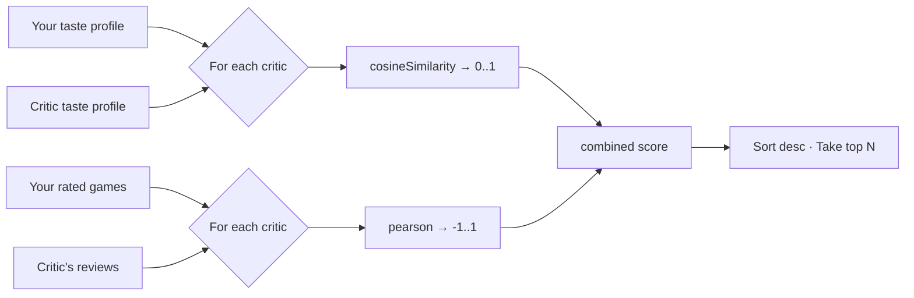

# Taste Matching

Two people who both love board games can have wildly different taste. **Taste matching** quantifies that gap so we can recommend critics whose recommendations you should actually trust.

## The six dimensions

Every user, every critic, and every game has a `TasteProfile` — a vector of six numbers:

```ts
// lib/taste.ts
export const TASTE_DIMENSIONS = [
  "strategy",  // crunch, engine-building, multi-step planning
  "thematic",  // narrative, immersion, world-building
  "party",     // social, fast, group dynamics
  "family",    // accessibility, kid-friendly, gateway
  "solo",      // single-player viability and design
  "conflict",  // direct interaction, take-that, PvP intensity
] as const;
```

Each dimension is a **0–100 score** representing how much that dimension is present (for games) or preferred (for users and critics).

## What the profile looks like

```ts
const alex: TasteProfile = {
  strategy: 90,
  thematic: 72,
  party: 30,
  family: 45,
  solo: 65,
  conflict: 55,
};

const brassBirmingham: TasteProfile = {
  strategy: 95,
  thematic: 60,
  party: 10,
  family: 30,
  solo: 50,
  conflict: 40,
};
```

These vectors are stored as JSON strings in the `taste_profile` column and parsed by `lib/queries/parsers.ts`.

## How matching works

`getMatchedCritics()` (in `lib/queries/user.ts`) returns a sorted list of critics for the current user:



### Step 1: Cosine similarity (preferences)

Cosine answers *"do you and this critic value the same dimensions?"*

```ts
const preferenceMatch = cosineSimilarity(user.tasteProfile, critic.tasteProfile);
// → e.g. 0.91
```

A score of `1` means your taste vectors point in the exact same direction. `0` means orthogonal.

### Step 2: Pearson correlation (calibration)

Pearson answers *"when this critic likes a game more than their average, do you also like it more than yours?"*

```ts
const ratingMatch = pearson(yourRatings, criticScoresForSameGames);
// → e.g. 0.68
```

A score of `1` means your ratings move in lockstep. `0` means no correlation. `-1` means they always disagree.

This step requires **overlap** — the critic must have reviewed games you've rated. With fewer than 2 overlapping games, Pearson is `0` and the critic falls back to cosine-only.

### Step 3: Combine

The two are blended into a final taste-match percentage that's displayed on critic profiles. A critic with `cosine=0.91, pearson=0.68` becomes roughly an **84% match** — a strong signal.

## What this powers

| Feature | How taste matching feeds it |
| --- | --- |
| **Matched Critics** list on `/me` | Sorted by combined match score |
| **Taste Match %** on critic profiles | The combined score, rendered as a percentage |
| **Radar charts** | The 6-dimension vector visualized via Recharts |
| **Personalized Predictions** | `getPersonalizedScore()` weights critic scores by match |
| **"Similar games"** | `cosineSimilarity(game.tasteProfile, candidate.tasteProfile)` |

## Why we don't use ML

For 14 critics and 60 games, a 6-dimension vector + Pearson is more than enough signal. It has three properties an ML model wouldn't easily give us:

1. **Interpretability** — every match has a human-readable explanation (strategy 90 vs 95, thematic 72 vs 60…).
2. **Cold-start friendly** — a brand-new user with one rating still gets sensible matches via cosine.
3. **Cheap** — pure functions over small arrays. No vector DB, no embedding pipeline, no GPU.

At scale (say, 10k critics) you'd want approximate nearest-neighbor indexing on the cosine side and a sparse matrix for Pearson. The current code makes the math obvious so the optimization path is too.

## Tuning

If you want to weight one dimension more than another (say, strategy is more important than conflict for your audience), modify `dot()` and `magnitude()` in `lib/scoring.ts` to accept per-dimension weights. The 6-dimension vector is small enough that tuning is fast.

Next: [Data Model](./data-model.md) for the underlying tables, or [Customizing Scoring](../guides/customizing-scoring.md) for hands-on changes.
